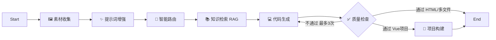

# Aigen - AI 原生智能前端代码生成平台

> 🚧 **项目状态：持续更新与优化中 (Active Development)**

Aigen 是一个基于 LLM（大语言模型）的智能软件工程 Agent 平台。通过自然语言对话，Aigen 能够自动完成**需求分析、素材收集、代码生成、质量检测、自动构建及部署**的全流程，支持生成单页 HTML、多文件项目以及完整的 Vue 3 工程。

## ✨ 核心特性

- **🤖 智能工作流编排**: 基于 LangGraph StateGraph 的 7 节点 Agent 工作流，涵盖素材收集 → 提示词增强 → 智能路由 → RAG 知识注入 → 代码生成 → 质量检查（含自动重试）
- **🧩 三种代码生成模式**: HTML 单页 / 多文件原生项目 / Vue 3 + Vite 完整工程
- **🛠️ 文件系统工具调用**: Agent 通过 Function Calling 自主读写、修改项目文件，实现增量式代码修改
- **🎨 自动化素材集成**: Pexels（图片）、Undraw（插画）、Mermaid（架构图）、DashScope Wanx（Logo）自动填充
- **🚀 自动构建与一键部署**: 自动执行 `npm install/build`，部署后截图预览
- **⚡ 沉浸式流式体验**: 全链路 SSE 实时展示 Agent 思考过程与代码生成进度

## 🏗️ 系统架构

本项目采用 **Java + Python 双栈 Monorepo 架构**：

```
前端 (Vue 3) → Nginx → Java Spring Boot ──→ PythonAiServiceClient (WebClient/SSE)
                           │                            │
                        业务逻辑                   Python FastAPI
                      用户/应用/部署               LangGraph 7节点工作流
```

### LangGraph 工作流拓扑



## 🛠️ 技术栈

### AI 服务端 (Python)


### 业务服务端 (Java)


### 前端 (Vue 3)


### 基础设施


## 📁 项目结构

```
Aigen/                              # Monorepo 根目录
├── aiegn-java-core/                # ☕ Java Spring Boot 主服务
│   ├── src/main/java/org/muchen/aigen/
│   │   ├── controller/             # REST API 控制器
│   │   ├── service/                # 业务逻辑
│   │   ├── client/
│   │   │   └── PythonAiServiceClient.java  # Python AI 服务 HTTP 代理
│   │   ├── model/                  # 实体 & DTO
│   │   └── config/
│   ├── src/main/resources/
│   │   └── application.yml         # 公共配置（密码读环境变量，不含明文）
│   ├── pom.xml
│   ├── mvnw / mvnw.cmd
│   └── Dockerfile.java             # JDK 21 Alpine 多阶段构建
│
├── aigen-python-ai/                # 🐍 Python AI 工作流服务
│   ├── app/
│   │   ├── api/endpoints/workflow.py   # SSE 流式代码生成接口
│   │   ├── graph/
│   │   │   ├── state.py                # AgentState (TypedDict)
│   │   │   ├── workflow.py             # StateGraph 编排 & 条件路由
│   │   │   └── nodes/                  # 7 个工作流节点
│   │   ├── tools/                      # 文件工具 + 图片工具
│   │   └── services/                   # LLM 工厂 & RAG 服务
│   ├── .env.example
│   └── Dockerfile
│
├── aigen-frontend/                 # 🖥️ Vue 3 + TypeScript 前端
│   ├── src/
│   ├── package.json
│   └── vite.config.ts
│
├── docker-compose.yml              # 5 服务完整编排
├── docker/
│   ├── nginx/                      # Nginx 配置（SSE proxy_buffering off）
│   └── mysql/init.sql
├── .env.example                    # 根目录环境变量模板（Docker 用）
└── .gitignore                      # 已排除 .env / node_modules / .venv
```

## 🚀 快速开始

### 方式一：Docker Compose（推荐）

```bash
# 1. 克隆项目
git clone https://github.com/Muchen010/Aigen.git
cd Aigen

# 2. 配置环境变量
cp .env.example .env
# 编辑 .env，至少填写 DASHSCOPE_API_KEY 和 MYSQL_ROOT_PASSWORD

# 3. 一键启动所有服务
docker compose up -d

# 4. 访问
# 前端:     http://localhost
# Java API: http://localhost:8123/api
# Python API 文档: http://localhost:8100/docs
```

### 方式二：本地开发模式

**① 启动 Python AI 服务**

```bash
cd aigen-python-ai

# 创建虚拟环境
py -3.12 -m venv .venv
.venv\Scripts\activate       # Windows
# source .venv/bin/activate  # Linux/Mac

# 安装依赖
pip install -e ".[dev]"

# 配置环境变量（必须）
copy .env.example .env
# 编辑 .env，填入 DASHSCOPE_API_KEY

# 启动（端口 8100）
uvicorn app.main:app --host 0.0.0.0 --port 8100 --reload
```

**② 启动 Java 主服务**

```bash
cd aiegn-java-core

# 创建本地配置（不会被 git 追踪）
# 新建 src/main/resources/application-local.yml，填入数据库密码等

# 启动（Java 21，端口 8123）
.\mvnw.cmd spring-boot:run
```

**③ 启动前端开发服务器**

```bash
cd aigen-frontend
npm install
npm run dev
```

## ⚙️ 环境变量说明

| 变量 | 说明 | 必填 |
|---|---|---|
| `DASHSCOPE_API_KEY` | 阿里云大模型 API Key (`sk-xxxx`) | ✅ |
| `DASHSCOPE_MODEL` | 模型名称，默认 `qwen-plus` | — |
| `PEXELS_API_KEY` | Pexels 图片搜索 Key | — |
| `MYSQL_ROOT_PASSWORD` | MySQL root 密码 | ✅ |
| `REDIS_PASSWORD` | Redis 密码（可为空） | — |
| `INTERNAL_SECRET` | Java ↔ Python 内部通讯密钥 | ✅ |
| `DB_PASSWORD` | Java 服务读取的 DB 密码（本地开发用） | ✅ |
| `COS_SECRET_ID / KEY` | 腾讯云 COS 密钥（截图上传） | — |

> 📌 **安全须知**: `.env` 和 `application-local.yml` 均已加入 `.gitignore`，**不会**被提交到 GitHub。请勿在 `application.yml` 中填写明文密码。

## 📡 API 接口

### Python AI 服务（`:8100`）

| 方法 | 路径 | 说明 |
|---|---|---|
| `GET` | `/api/v1/ai/health` | 健康检查 |
| `GET` | `/api/v1/ai/workflow/generate` | 代码生成工作流（SSE 流式） |
| `GET` | `/api/v1/ai/chat/stream` | LLM 对话（流式） |
| `POST` | `/api/v1/ai/chat/invoke` | LLM 对话（同步） |

### Java 主服务（`:8123/api`）

| 方法 | 路径 | 说明 |
|---|---|---|
| `POST` | `/app/create` | 创建应用 |
| `GET` | `/app/chat/{appId}` | 触发 AI 代码生成（SSE） |
| `POST` | `/app/deploy` | 部署应用 |
| `GET` | `/app/list` | 获取应用列表 |

> 📖 完整文档：`http://localhost:8123/api/doc.html`（Knife4j Swagger UI）

## 🔧 开发说明

### 架构设计原则

- **Java 端**：专注业务逻辑（用户、应用 CRUD、部署、截图），通过 `PythonAiServiceClient` 以 HTTP/SSE 代理 AI 工作流
- **Python 端**：专注 AI 工作流（LangGraph 节点、Tool Calling、LLM 交互），不包含业务逻辑
- **通讯方式**：Java → Python 使用 WebClient SSE 透传，前端无感知

### 新增 LangGraph 节点

```python
# 1. 在 aigen-python-ai/app/graph/nodes/ 新建节点文件
async def your_node(state: AgentState) -> dict:
    return {"current_step": "your_node", "your_field": result}

# 2. 在 graph/workflow.py 的 build_workflow() 中注册
graph.add_node("your_node", your_node)
graph.add_edge("prev_node", "your_node")

# 3. 在 api/endpoints/workflow.py 的 _step_labels 中添加中文标签
_step_labels = {"your_node": "你的节点名称"}
```

## 📄 License

MIT License

---

> 💡 **关于技术迁移**：本项目已从单体 Java AI（LangChain4j + LangGraph4j）完整迁移到 Java + Python 双栈架构，AI 工作流运行在 Python/LangGraph，Java 仅作代理和业务层。
